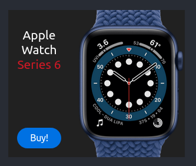

# HTML Banner

HTML banners with focusing on pure CSS and JavaScript animation and interaction with the user's events also performance and size matters.

## Installation

You need to install [Node js](https://nodejs.org/) on your system.

After installing Node js, open your terminal (command line) in the root directory of the app and run the command `npm install`.

## Running the App

After the installation, you can run the command `npm run dev` to start the app. It will be served on [http://localhost:9000](http://localhost:9000).

## Tools Used

There are no CSS or JS libraries used for this project. However these tools have been used:

- [Parcel.js](https://parceljs.org/) as the application bundler
- Eslint as the linter
- Prettier as the code formatter
- [Sass](https://sass-lang.com/) as the css preprocessor

## List of Banners

To see each banner on development or build please change
these lines on package.json to banner folder name

- "main": "src/banner-folder-name/js/main-script.js"
- "parcel src/banner-folder-name/index.html --port 9000"
- "parcel build src/banner-folder-name/index.html"
- "src/banner-folder-name/assets"

### Apple watch

banner folder name: apple-watch

### Remote work

banner folder name: remote-work

